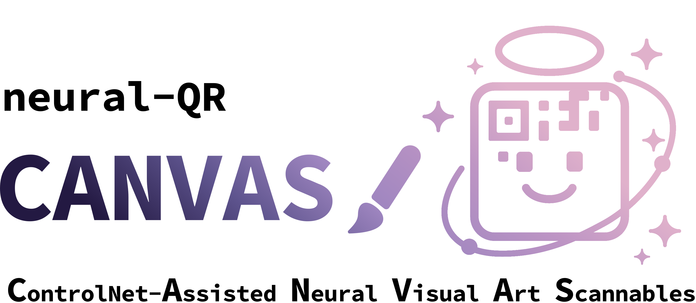

# neural-QR
**Paint your data into scannable art.**  
Stable Diffusion–powered, flexible, _artistic_ QR code generation that (mostly) actually scans.

  

> TL;DR: neural-QR turns any payload (URL, Wi-Fi, vCard, events, etc.) into high-fidelity art QRs using Stable Diffusion + ControlNet, with a flexibility-first pipeline and tooling for prompts, sweeps, and animations. Optimized for Apple Silicon or NVIDIA.

---

## Table of Contents
- [Why neural-QR](#why-neural-qr)
- [Features](#features)
- [How it Works](#how-it-works)
- [Install](#install)
- [Quickstart](#quickstart)
- [Inputs Supported](#inputs-supported)
- [Parameters That Matter](#parameters-that-matter)
- [Examples / Gallery](#examples--gallery)
- [Performance & Compatibility](#performance--compatibility)
- [Scannability Checklist](#scannability-checklist)
- [Roadmap](#roadmap)
- [License](#license)

---

## Why neural-QR
Most "artistic QR" projects either stop at novelty or trap you in proprietary black boxes. **neural-QR** is open end-to-end and built to integrate, extend, and scale:
- **Open by design:** Runs entirely on open models and OSS tooling. No closed APIs, no paywalled endpoints, no surprises.
- **Ecosystem-friendly:** Plug in SD 1.5/XL checkpoints, ControlNets, and LoRAs from Hugging Face or Civitai; swap schedulers or model components without rewriting your pipeline.
- **Aesthetic control, automated:** Structured prompt generators + deterministic seeds + batch sweeps give you controllable style exploration that still lands on scannable outputs.

---

## Features
- **AI-Powered QR Art:** Convert functional QR matrices into high-impact visuals with Stable Diffusion.
- **ControlNet Guidance:** Preserve finder patterns, timing patterns, and modules so the final image still decodes.
- **Multi-Platform:** CUDA (NVIDIA), MPS (Apple Silicon), or CPU. Automatic device detection + safe fallbacks.
- **Smart Noise Application:** Tiered noise: border / modules / center to control where diffusion happens.
- **Intelligent Prompting:** Auto-generator blends verbs, adjectives, subjects, art styles, themes (20+ curated buckets). Prompt override possible.
- **Parameter Sweeps:** Batch runs to explore seeds, strengths, schedulers, steps—find the sweet spot fast.
- **QR Animations:** Optional step-wise GIF export from pure noise to final frame.
- **Logo Masking:** Reserve a clean central area for brand marks without murdering the scanner.
- **Color Inversion:** Flip schemes when you need dark-on-light vs light-on-dark for better contrast or aesthetic.
- **Flexible Resolution:** Typical 768–1024px, configurable higher if your VRAM can handle it.

---

## How it Works

Key idea: **ControlNet locks structure** where scanners need it, while the model paints everything else. The tiered noise keeps the "math bits" readable and the "art bits" expressive.

---

## Install
> Requires **Python 3.10+** and a recent **PyTorch** build (CUDA 11.8+ for NVIDIA, MPS for Apple Silicon). Disk space ~8–12 GB for models/caches depending on checkpoints.

> **Note:** Model names/checkpoints are configurable in this repo. If you prefer SDXL vs SD1.5 or a specific QR-focused ControlNet, set that in the config/flags below.

---

## Quickstart

**1) Minimal Run** — generate an artistic QR for a URL with a style prompt.

**2) Automatic Prompting** — let the built-in prompt mixer blend styles.

**3) Parameter Sweep** — find the sweet spot.

**4) Animate the Diffusion**

---

## Inputs Supported
- **URL / Text** – Any link or plain text payload  
- **Wi-Fi** – `WIFI:S:<ssid>;T:<WEP|WPA|nopass>;P:<password>;H:<true|false>;`
- **vCard** – `BEGIN:VCARD…END:VCARD` (name, phone, email, org, etc.)
- **Email** – `mailto:user@domain?subject=…&body=…`
- **Geolocation** – `geo:latitude,longitude?q=Label`
- **Calendar** – iCalendar (VEVENT) strings for sharable events

---

## Parameters That Matter

---

## Examples / Gallery
> 

  
  
  

  
More examples

  
  
  

---

## Performance & Compatibility
- **CUDA (NVIDIA)** – Fastest path. Aim for 12 GB VRAM for 1024px comfort. After that fallback to system memory.  
- **MPS (Apple Silicon)** – Works well on M2/M3; enable attention slicing to keep memory sane.  
- **CPU** – Works, but you’ll have time to reflect on life choices. Use low steps/resolution.

Memory-savvy toggles implemented:
- **Attention slicing** and optional **CPU offload**
- **Autocast/FP16** where safe
- Chunked batching for sweeps

---

## Scannability Checklist
Because "beautiful but broken" isn’t a win.

- **QR Error Correction**: Use appropriate level (M or Q is a good starting point).  
- **Creative Zone**: Keep a clean margin around the code (at least 4 modules).  
- **Contrast**: Dark modules on light background scan best; if in doubt, **`--invert`**.  
- **Prompt Adherence**:

- **controlNet Strength**:

- **Test it**: 

---

## Roadmap
- [ ] SDXL-first pipeline with QR-aware adapters
- [ ] In-painting pass for logo insertion with structural checks
- [ ] Web UI (FastAPI + minimal React) for client demos
- [ ] Automatic multi-scanner validation & scoring
- [ ] Prompt library export/import & runbooks

---

## License
This project is released under the .... License
Model checkpoints remain subject to their respective licenses/ToS.

---

### Credits
- Stable Diffusion & ControlNet ecosystems for the core generative backbone.
- Everyone building QR-aware control models and sharing research/artifacts.

---