# neural-QR
**Paint your data into scannable art.**  
Stable Diffusion–powered, flexible, _artistic_ QR code generation that (mostly) actually scans.

  <picture>
    <source media="(prefers-color-scheme: dark)" srcset="ressources/canvas_banner_dark.png">
    <source media="(prefers-color-scheme: light)" srcset="ressources/canvas_banner_light.png">
    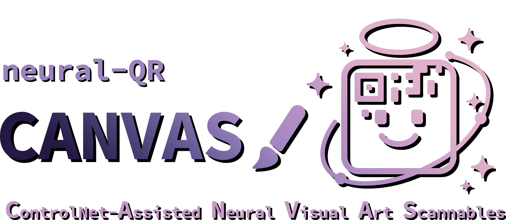
  </picture>

> TL;DR: neural-QR turns any payload (URL, Wi-Fi, vCard, events, etc.) into high-fidelity art QRs using Stable Diffusion + ControlNet, with a flexibility-first pipeline and tooling for prompts, sweeps, and animations. Optimized for Apple Silicon or NVIDIA. Try Parameters Explorer [here](https://tillzacher.github.io/neural-QR/grid-explorer.html).

---

## Table of Contents
- [Why neural-QR](#why-neural-qr)
- [Features](#features)
- [How it Works](#how-it-works)
- [Install](#install)
- [Quickstart](#quickstart)
- [Supported Inputs](#supported-inputs)
- [Parameters That Matter](#parameters-that-matter)
- [Examples](#examples)
- [Performance & Compatibility](#performance--compatibility)
- [Scannability Checklist](#scannability-checklist)
- [License](#license)

---

## Why neural-QR
**neural-QR** is open end-to-end and built to integrate, extend, and scale:
- **Open by design:** Runs entirely on open models and OSS tooling. No closed APIs, no paywalled endpoints, no surprises.
- **Ecosystem-friendly:** Plug in SD 1.5/XL checkpoints, ControlNets, and LoRAs from Hugging Face or Civitai; swap schedulers or model components without rewriting your pipeline.
- **Aesthetic control, automated:** Structured prompt generators + deterministic seeds + batch sweeps give you controllable style exploration that still lands on scannable outputs.

---

## Features
- **AI-Powered QR Art:** Convert functional QR matrices into high-impact visuals with Stable Diffusion.
- **ControlNet Guidance:** Preserve finder patterns, timing patterns, and modules so the final image still decodes.
- **Multi-Platform:** CUDA (NVIDIA), MPS (Apple Silicon), or CPU. Automatic device detection + safe fallbacks.
- **Smart Noise Application:** Tiered noise: border / modules / center to control where diffusion happens.
- **Intelligent Prompting:** Auto-generator blends verbs, adjectives, subjects, art styles, themes (20+ curated buckets). Prompt override possible.
- **Parameter Sweeps:** Batch runs to explore seeds, strengths, schedulers, steps—find the sweet spot fast.
- **QR Animations:** Optional step-wise GIF export from pure noise to final frame.
- **Logo Masking:** Reserve a clean central area for brand marks without murdering the scanner.
- **Color Inversion:** Flip schemes when you need dark-on-light vs light-on-dark for better contrast or aesthetic.
- **Flexible Resolution:** Typical 768–1024px, configurable higher if your VRAM can handle it.

---

## How it Works

Key idea: **ControlNet locks structure** where scanners need it, while the model paints everything else. The tiered noise keeps the code bits readable and the art bits expressive.

---

## Install
> Requires **Python 3.10+** and a recent **PyTorch** build (CUDA 11.8+ for NVIDIA, MPS for Apple Silicon). Disk space ~8–12 GB for models/caches depending on checkpoints.

**1) Install Dependencies**

**2) Download Model Checkpoints**
- ControlNet Checkpoints are downloaded automatically assuming huggingface token is set. By default from [monster-labs](https://huggingface.co/monster-labs/control_v1p_sd15_qrcode_monster/commits/main/v2). Shoutout to @monster-labs for sharing this great model! Other controlnets can be passed into the function call under the `controlnet_model_id` parameter.
- Stable Diffusion Checkpoints: Stable Diffusion 1.5 Checkpoints have to be provided in diffusers format. Place them in the `models/` folder and referr to this folder in the `model_id` input parameter.

---

## Quickstart

In the `entry.ipynb` notebook, you will find example function calls that demonstrate how to use the library.
Output images will be saved to the `output_images/` folder.

_Tip:_ In `output_images/temp/`, you can find intermediate images from the diffusion process for debugging or just to see how the model is progressing step-by-step. Just open the `latest_intermediate.png` file in a extra vscode tab.

## Scannability Checklist
Because beautiful but broken isn’t a win.

- **QR Error Correction**: Use appropriate level (M or Q is a good starting point).  
- **Creative Zone**: Keep a clean margin around the code (at least 4 modules).  
- **Prompt Adherence**: Guides how much the model follows your prompt. Choose values between 7-15.
- **controlNet Strength**: Adjusts how closely the QR structure is followed. Choose values between 0.7-2.0. Usually, prompt adherence and controlNet strength describe a trade-off between creativity and scannability.

- **Steps**: More steps = more detail, but slower processing. 20-50 is a good range.

See [github pages page](https://tillzacher.github.io/neural-QR/grid-explorer.html) for interactive demo where the key parameters can be adjusted live.

---

## Supported Inputs
- **URL / Text** – Any link or plain text payload  
- **Wi-Fi** – `WIFI:S:<ssid>;T:<WEP|WPA|nopass>;P:<password>;H:<true|false>;`
- **vCard** – `BEGIN:VCARD…END:VCARD` (name, phone, email, org, etc.)
- **Email** – `mailto:user@domain?subject=…&body=…`
- **Geolocation** – `geo:latitude,longitude?q=Label`
- **Calendar** – iCalendar (VEVENT) strings for sharable events

---

## Examples

  
  

  
Static images

  

    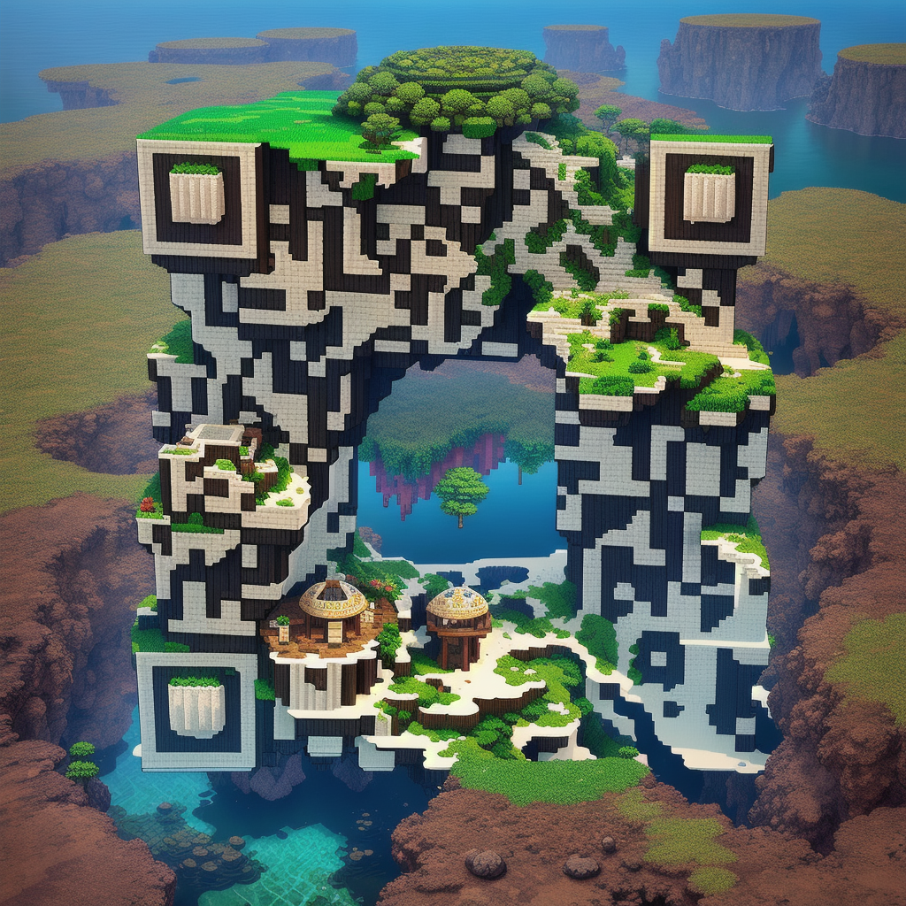
    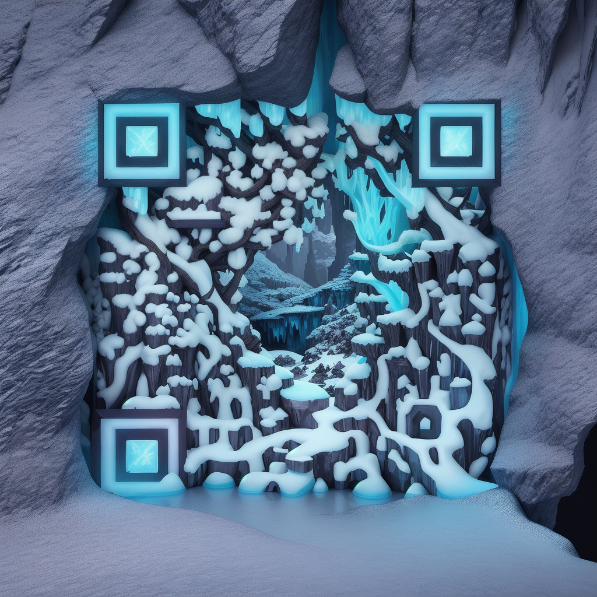
    
  

  

    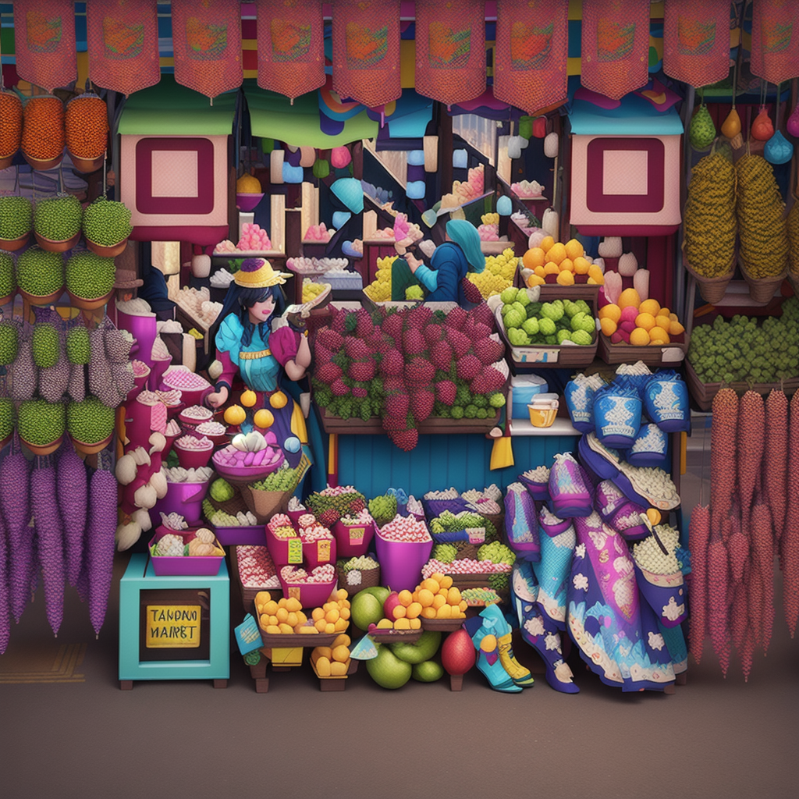
    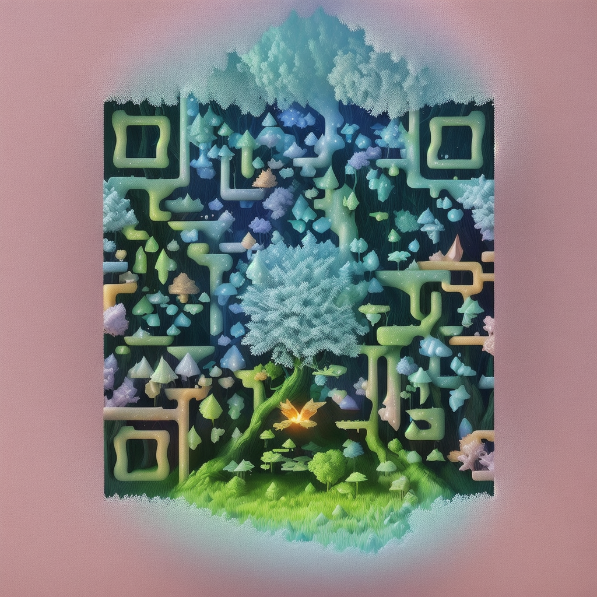
    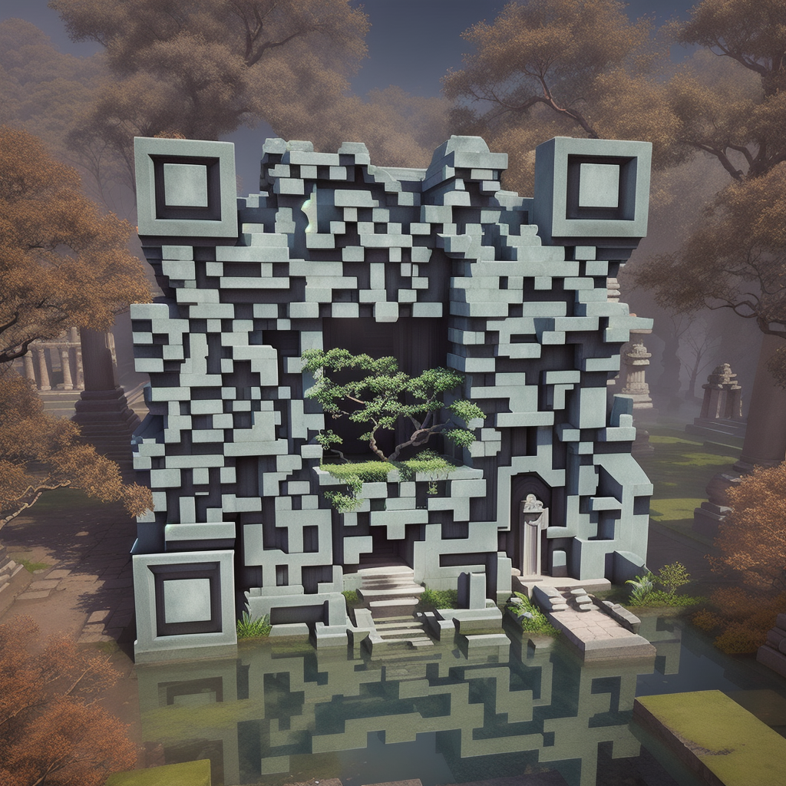
  

  

    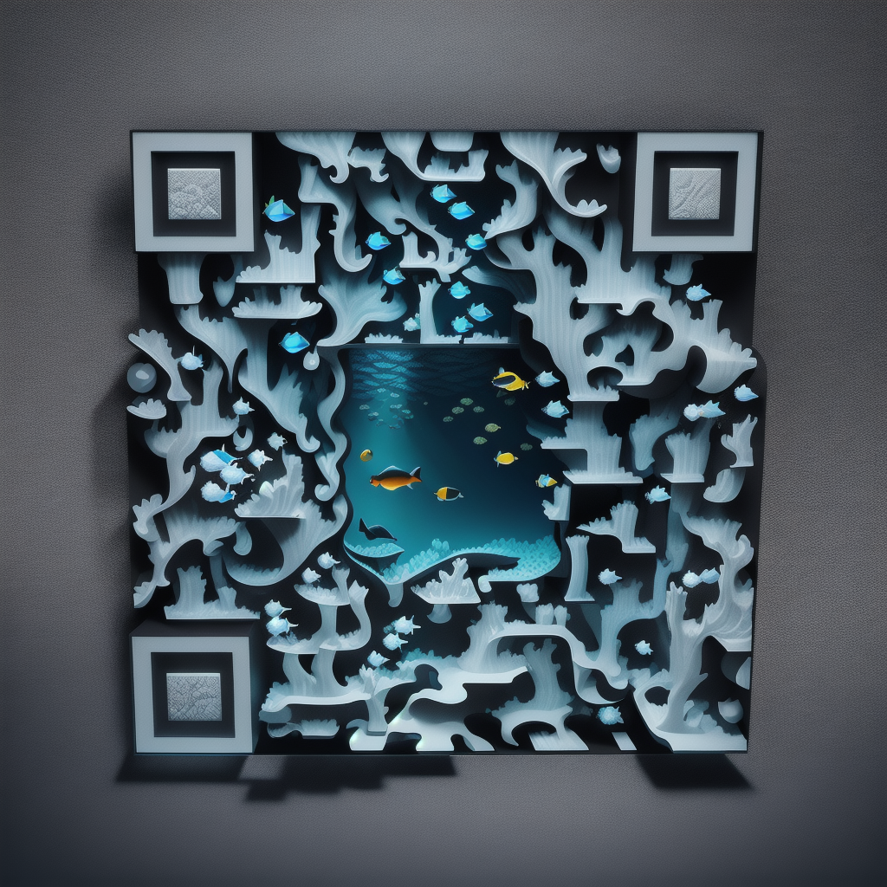
    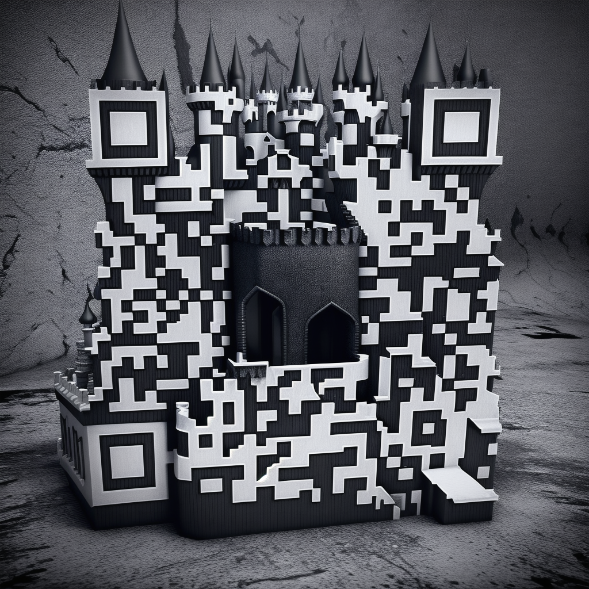
    
  

  

    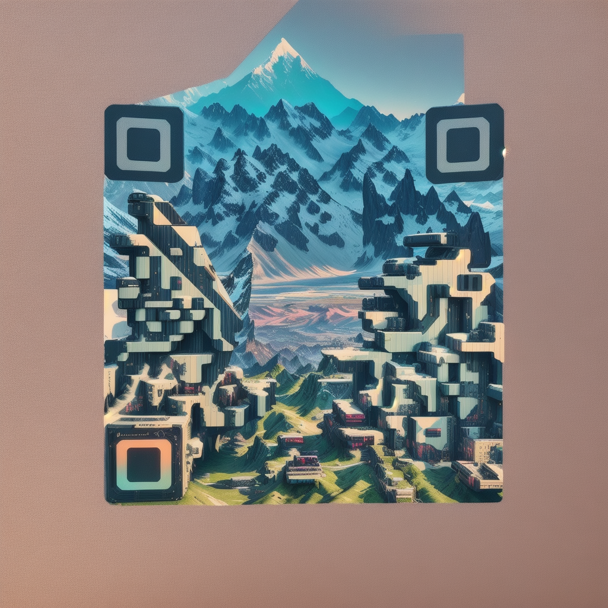
    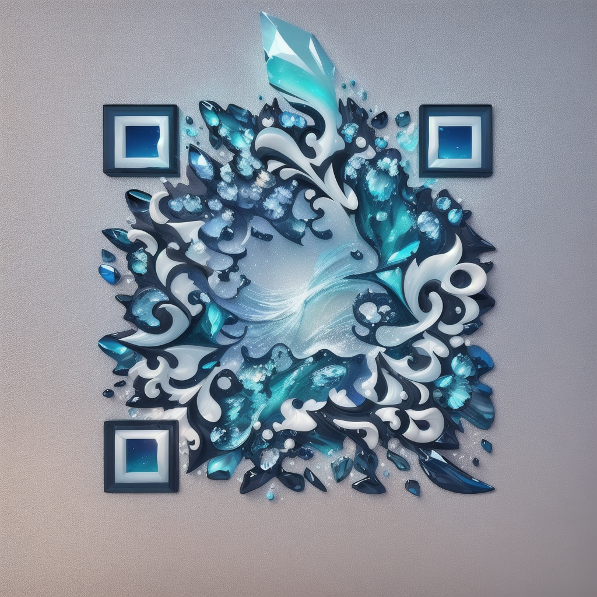
    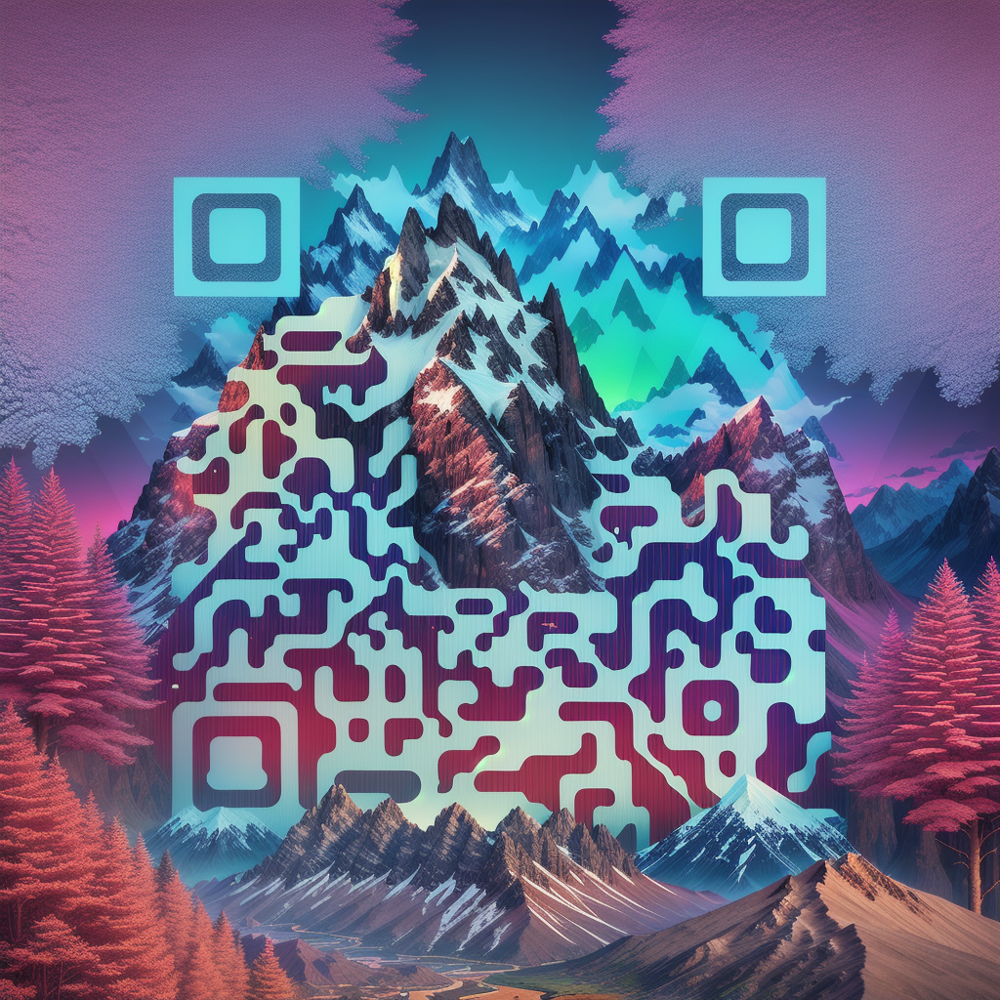
  

---

## Performance & Compatibility
- **CUDA (NVIDIA)** – Fastest path. Aim for 12 GB VRAM for 1024px comfort. After that fallback to system memory.  
- **MPS (Apple Silicon)** – Works well on M2/M3; enable attention slicing to keep memory sane.  
- **CPU** – Works, but you’ll have time to reflect on life choices. Use low steps/resolution.

Memory optimization with:
- **Attention slicing** and optional **CPU offload**
- **Autocast/FP16** where safe
- Chunked batching for sweeps

---